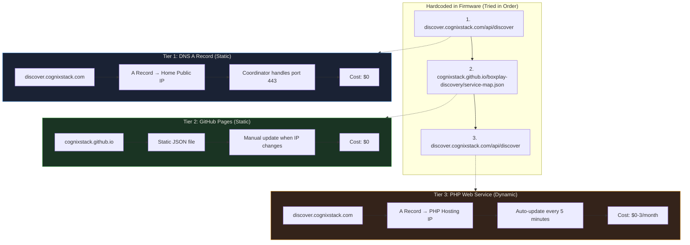

## Three-Tier Discovery Architecture

```mermaid
flowchart TD
    subgraph Firmware["Hardcoded in Firmware (Tried in Order)"]
        direction TB
        F1["1. discover.cognixstack.com/api/discover"]
        F2["2. cognixstack.github.io/boxplay-discovery/service-map.json"]
        F3["3. discover.cognixstack.com/api/discover"]
        F1 --> F2 --> F3
    end
    
    subgraph Tier1["Tier 1: DNS A Record (Static)"]
        T1A["discover.cognixstack.com"]
        T1B["A Record → Home Public IP"]
        T1C["Coordinator handles port 443"]
        T1D["Cost: $0"]
        T1A --> T1B --> T1C --> T1D
    end
    
    subgraph Tier2["Tier 2: GitHub Pages (Static)"]
        T2A["cognixstack.github.io"]
        T2B["Static JSON file"]
        T2C["Manual update when IP changes"]
        T2D["Cost: $0"]
        T2A --> T2B --> T2C --> T2D
    end
    
    subgraph Tier3["Tier 3: PHP Web Service (Dynamic)"]
        T3A["discover.cognixstack.com"]
        T3B["A Record → PHP Hosting IP"]
        T3C["Auto-update every 5 minutes"]
        T3D["Cost: $0-3/month"]
        T3A --> T3B --> T3C --> T3D
    end
    
    F1 -.-> Tier1
    F2 -.-> Tier2
    F3 -.-> Tier3
    
    style Tier1 fill:#1a2234,stroke:#378ADD,color:#e8e6e0
    style Tier2 fill:#1a3423,stroke:#4CAF50,color:#e8e6e0
    style Tier3 fill:#34231a,stroke:#EF9F27,color:#e8e6e0
```
